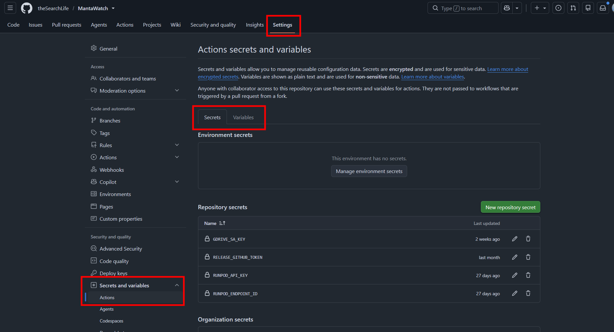
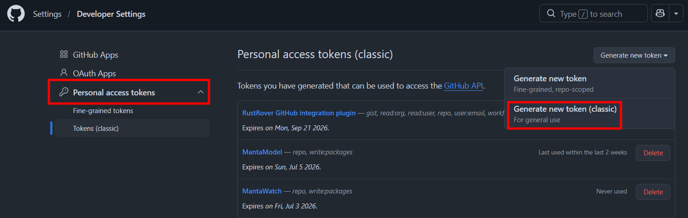
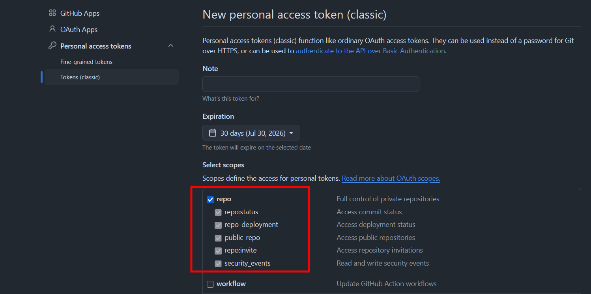
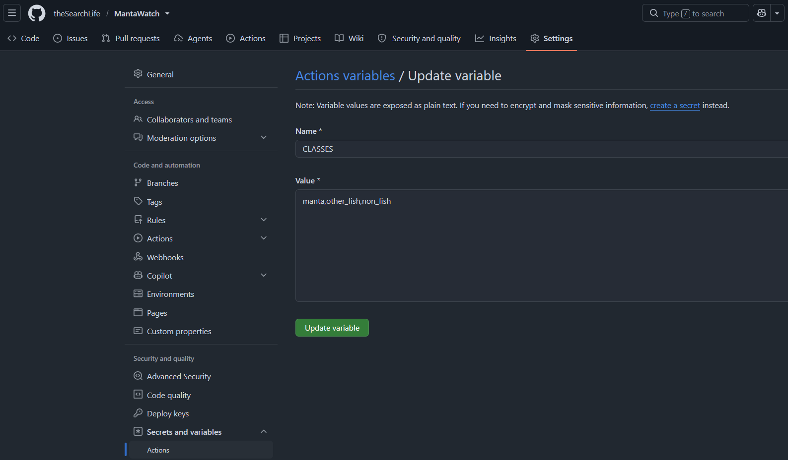
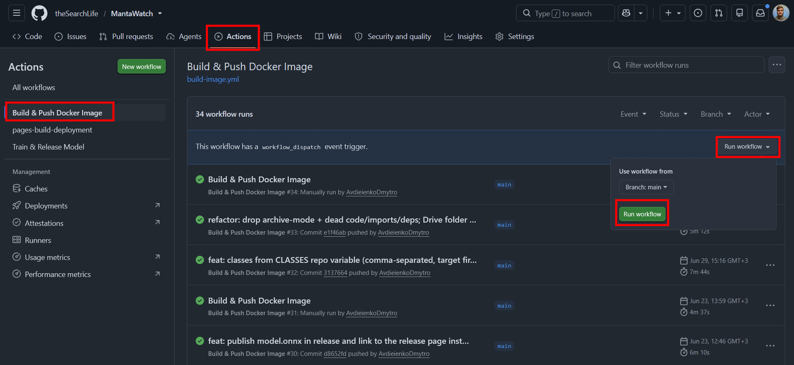
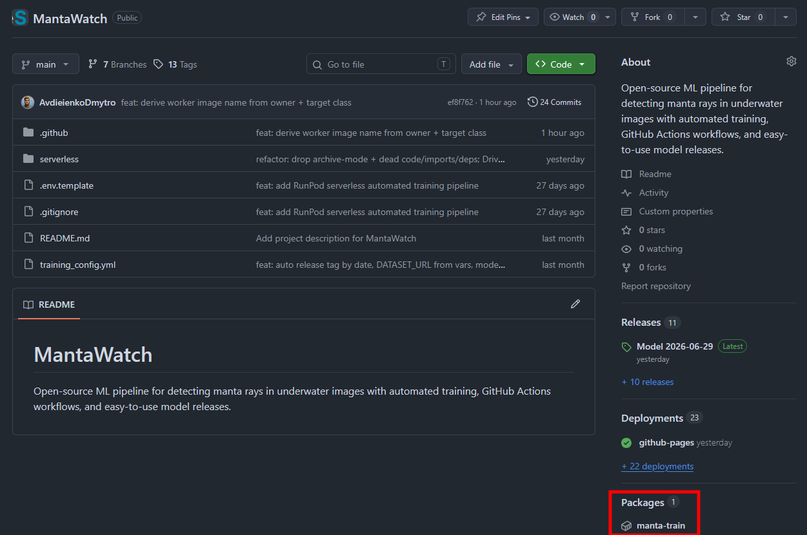
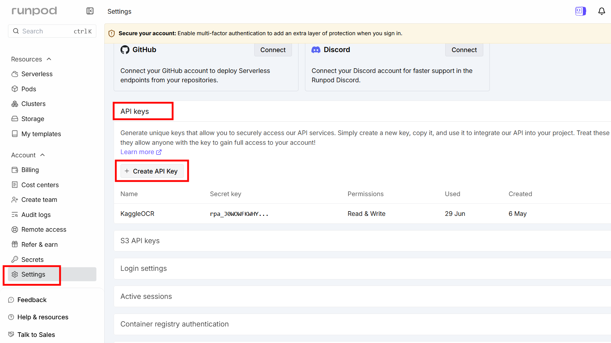
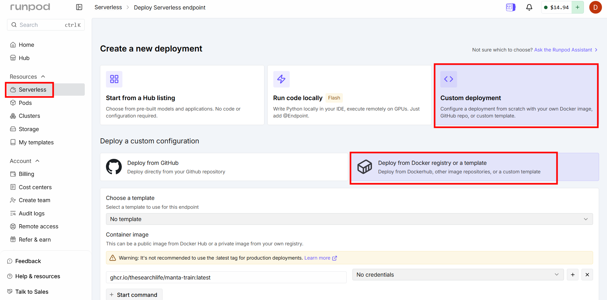
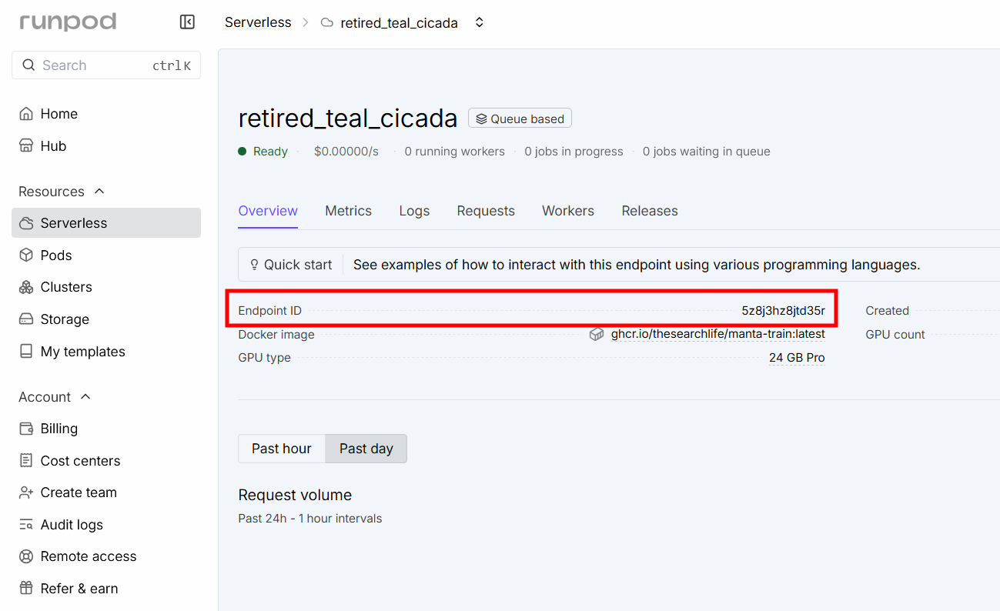
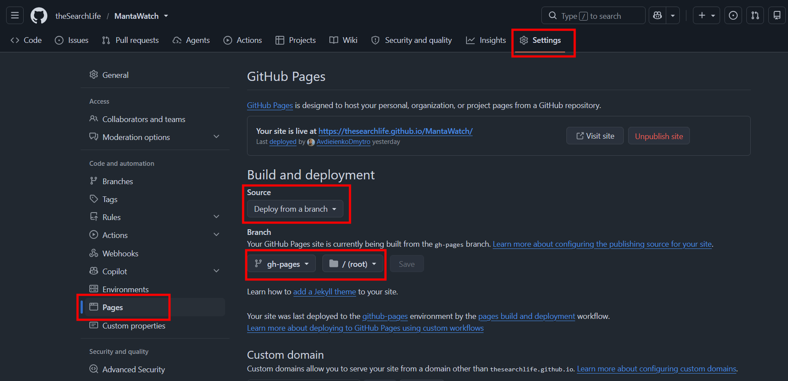

# Setup guide

**Start by making your own copy of this repository** — fork it, or click the green **Use
this template** button — so its Actions, secrets, and container image live under your own
account/org. Everything below configures that copy.

The rest is one-time configuration, in the order you'd actually do it — grouped by service
so you don't bounce between tabs. After this, training is one button-click (see
[usage.md](usage.md)).

By the end you'll have:

- **4 GitHub secrets** — `RELEASE_GITHUB_TOKEN`, `GDRIVE_SA_KEY`, `RUNPOD_API_KEY`, `RUNPOD_ENDPOINT_ID`
- **2 GitHub variables** — `CLASSES`, `DATASET_URL`
- a worker image on GHCR, a configured RunPod endpoint, and GitHub Pages enabled.

Secrets and variables both live under **Repo → Settings → Secrets and variables →
Actions** (Secrets tab / Variables tab).



---

## Step 1 — GitHub (start here)

You're already in the repo, so do the GitHub-only pieces first.

### 1a. Token → secret `RELEASE_GITHUB_TOKEN`

The worker uses this to create Releases and publish the report to `gh-pages`.

1. Open **[github.com/settings/tokens](https://github.com/settings/tokens)** → **Generate
   new token → Generate new token (classic)**.

   

2. **Tick `repo`** — the only scope needed; leave everything else unchecked. (For a public
   repo you may narrow it to `public_repo`.)

   

3. Set an expiration, generate, and copy the token into the `RELEASE_GITHUB_TOKEN` secret.

### 1b. Classes → variable `CLASSES`

Comma-separated class names, **target class first** (e.g. `manta,other_fish,non_fish`).

- The **first** entry is the target — the report is "target vs everything-else", scored
  by **F2 of that class**.
- Any number of classes works (one target + any number of others).
- For another animal it might be `cuckoo,other_bird,non_bird`.
- The names must exactly match the dataset's class folders ([Step 2a](#2a-create-the-dataset-folder)),
  or the run fails fast with a clear error.



### 1c. (First time only) Build the worker image

The GPU worker runs the code in `serverless/`, packaged as a Docker image on GitHub
Container Registry (GHCR).

1. **Actions → Build & Push Docker Image → Run workflow.** (It also runs automatically on
   pushes to `main` that change `serverless/handler.py` or `Dockerfile`.)

   

2. The image is named **`ghcr.io/<owner>/<target>-train:latest`** — automatically derived
   from your repo owner and your **first class** (so set `CLASSES` in 1b first). For
   `manta`, that's `ghcr.io/<owner>/manta-train:latest`. **Note this name — you'll paste it
   into RunPod in [Step 3](#step-3--runpod).**
3. **Permissions / visibility:**
   - After the first run the GHCR package is **private**. For RunPod to pull it, either
     **make it public** (your profile/org → **Packages** → the package → **Package settings
     → Change visibility → Public**), or add registry credentials in the RunPod endpoint
     later.
   - On an **organization** repo, also ensure Actions is allowed to create/write packages
     (org **Settings → Packages / Actions permissions**).

   

It takes a few minutes — kick it off and move on to Step 2 while it builds.

---

## Step 2 — Google: Drive + Cloud (one visit)

Do all the Google work in one go: dataset folder, service-account key, share, link.

### 2a. Create the dataset folder

One Drive folder with this shape — the same class subfolders (matching `CLASSES`) under
each of `train/`, `val/`, `test/`:

```
my-dataset/                ← this folder's link becomes DATASET_URL
├── train/
│   ├── manta/
│   ├── other_fish/
│   └── non_fish/
├── val/
│   ├── manta/
│   ├── other_fish/
│   └── non_fish/
└── test/
    ├── manta/
    ├── other_fish/
    └── non_fish/
```

### 2b. Service account + key → secret `GDRIVE_SA_KEY`

A **service account** is a "robot" Google account the worker logs in as to download the
dataset — it avoids the quotas that break anonymous access at scale.

1. Open the [Google Cloud Console](https://console.cloud.google.com/).
2. Create a project (or pick one).
3. **Enable the Drive API**: APIs & Services → **Library** → "Google Drive API" → **Enable**.
4. **Create the service account**: IAM & Admin → **Service Accounts → Create**. Any name
   (e.g. `dataset-reader`); no roles needed → **Done**.
5. **Create a JSON key**: the service account → **Keys → Add key → Create new key → JSON →
   Create**. A `.json` downloads — **this file is the secret**.
6. Paste the **entire contents** of the `.json` into the `GDRIVE_SA_KEY` secret.
7. **Copy the service-account email** (`dataset-reader@your-project.iam.gserviceaccount.com`)
   — you need it in 2c.

### 2c. Share the folder with the service account

Right-click the top dataset folder → **Share** → paste the service-account email → role
**Viewer** → Send. The folder does **not** need to be public.

> ⚠️ This is the step people forget. If the folder isn't shared with the SA email,
> downloads fail with "not found / no access".

### 2d. Folder link → variable `DATASET_URL`

**Share → Copy link** on the dataset folder, and paste it into the `DATASET_URL` variable.
It looks like `https://drive.google.com/drive/folders/1AbC...`.

---

## Step 3 — RunPod

Do both RunPod pieces in one visit.

### 3a. API key → secret `RUNPOD_API_KEY`

Open **[console.runpod.io/user/settings](https://console.runpod.io/user/settings)** →
**API Keys → Create API Key** → copy it into the `RUNPOD_API_KEY` secret.



### 3b. Endpoint → secret `RUNPOD_ENDPOINT_ID`

**Create it:** Serverless → **+ New Endpoint** → **Custom deployment** → **Deploy from
Docker registry or a template** → **Container image** = the name from
[Step 1c](#1c-first-time-only-build-the-worker-image) (e.g.
`ghcr.io/<owner>/manta-train:latest`; add registry credentials here if the package is
private) → **Configure endpoint** → **GPU configuration = 24 GB (Pro)** (important — enough
VRAM for training) → **Create endpoint**.



**Then adjust it:** **Manage → Edit endpoint** →

- **Max workers = 3**
- **Enable execution timeout**, **Execution timeout = 21600 sec** (6 h) — caps runaway
  training. It matches the GitHub Action's 6-hour limit; if 6 h isn't enough, something is
  wrong.
- **Docker configuration → Container disk = 40 GB** — room for the dataset, resized
  images, and model checkpoints (the default is too small).

Finally, copy the endpoint's **Endpoint ID** into the `RUNPOD_ENDPOINT_ID` secret.



---

## Step 4 — GitHub (finish)

### 4a. Enable GitHub Pages

So the report is viewable.

1. Repo → **Settings → Pages**.
2. **Source: Deploy from a branch** → **Branch: `gh-pages`**, folder **`/ (root)`** → **Save**.



The report URL is then `https://<owner>.github.io/<repo>/`.

> ⚠️ **On a fresh clone the `gh-pages` branch doesn't exist yet**, so it won't appear in the
> Branch dropdown. It's created automatically the first time a training run publishes a
> report. So run **one training run first** (its report link will 404 until you finish this
> step), then come back here and select `gh-pages`. See [Troubleshooting](#troubleshooting) —
> this corner is still being smoothed out.

### 4b. Final checklist

- [ ] Secrets: `RELEASE_GITHUB_TOKEN`, `GDRIVE_SA_KEY`, `RUNPOD_API_KEY`, `RUNPOD_ENDPOINT_ID`
- [ ] Variables: `CLASSES`, `DATASET_URL`
- [ ] Worker image built and reachable by RunPod (public, or creds added)
- [ ] Drive folder structured `train/val/test` → class subfolders matching `CLASSES`
- [ ] Drive folder shared with the service-account email
- [ ] RunPod endpoint created; ID in `RUNPOD_ENDPOINT_ID`
- [ ] GitHub Pages enabled on `gh-pages`

You're ready — see [usage.md](usage.md) to run training.

---

## Adapting to a new animal

Everything animal-specific is configuration, so switching targets is:

1. Put the new dataset in a Drive folder (same `train/val/test` + class-subfolder shape);
   share it with the service account; set `DATASET_URL` to its link.
2. Set `CLASSES` to the new classes, target first (e.g. `cuckoo,other_bird,non_bird`).
3. Re-run **Build & Push Docker Image** — the image name follows the new target
   (`ghcr.io/<owner>/cuckoo-train:latest`); point the RunPod endpoint at it.

No code changes. (Re-branding the report title is a separate, optional change.)

---

## Troubleshooting

**`gh-pages` doesn't appear in the Pages branch dropdown (fresh clone).** The branch is
created by the worker the first time it publishes a report, so it doesn't exist before your
first training run. Work around it by running training once, then enabling Pages
([Step 4a](#4a-enable-github-pages)); the very first report link 404s until you do. *(A
future tweak may pre-create the branch — e.g. a one-off workflow that pushes an empty
`gh-pages` — so Pages can be enabled up front.)*

For run-time issues (class mismatch, report 404, evaluation failures, stuck jobs) see
[usage.md → Troubleshooting](usage.md#7-troubleshooting).
