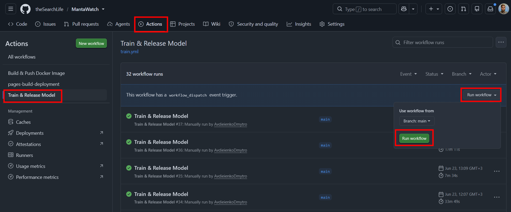
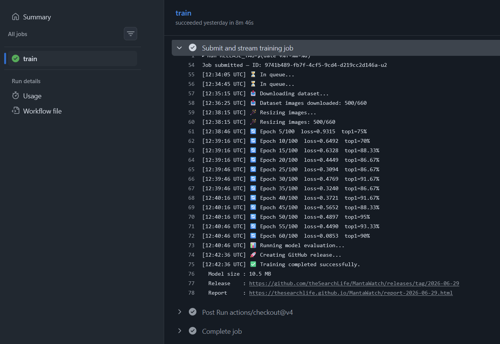

# Usage guide

Day-to-day use, once [setup](setup.md) is done. No coding required.

1. [Add images to the dataset](#1-add-images-to-the-dataset)
2. [Run training](#2-run-training)
3. [Watch progress](#3-watch-progress)
4. [Read the report](#4-read-the-report)
5. [Get the model](#5-get-the-model)
6. [Troubleshooting](#6-troubleshooting)

---

## 1. Add images to the dataset

The dataset is the Google Drive folder configured as `DATASET_URL`. It has three splits,
each with the same one-subfolder-per-class layout:

```
my-dataset/
├── train/                  ← model learns from these (grows over time)
│   ├── manta/
│   ├── other_fish/
│   └── non_fish/
├── val/                    ← used during training to pick the best checkpoint
│   ├── manta/
│   ├── other_fish/
│   └── non_fish/
└── test/                   ← used to score the model for the report — keep FIXED
    ├── manta/
    ├── other_fish/
    └── non_fish/
```

To add images: open the relevant class folder in Google Drive and **drag the image files
in** (or use Upload). For example, new confirmed manta photos go into `train/manta/`.

Guidelines:

- Put each image in the folder matching what it actually is.
- **Keep `test/` (and ideally `val/`) fixed** between runs. The report compares the new
  model against the previous one on the test set — if the test set changes, the comparison
  isn't apples-to-apples.
- The class folder names must match the `CLASSES` variable exactly. If you add a new class,
  update `CLASSES` too (target class stays first).

---

## 2. Run training

1. Go to the repo's **Actions** tab.
2. Select **Train & Release Model** in the left list.
3. Click **Run workflow → Run workflow**.

That's it — the GPU worker spins up, trains, evaluates, and (if the model passes the
quality gate) publishes a release and report.



---

## 3. Watch progress

Open the running workflow to see live logs. Key lines:

| Log line | Meaning |
|---|---|
| `📥 Dataset images downloaded: N/total` | Fetching the training set from Drive. |
| `🪄 Resizing images: N/total` | One-time downscale on the worker (speeds up training). |
| `🔄 Epoch X/Y  loss=…  top1=…%` | Training progress. |
| `📊 Test images evaluated: N/total` | Scoring on the test set. |
| `🚀 Creating GitHub release...` | The model passed the gate and is being released. |
| `✅ Training completed successfully.` | Done — with links to the Release and Report. |

If the new model is **worse** than the previous one, you'll instead see a `Release SKIPPED`
note — the report is still published so you can see why.



---

## 4. Read the report

The run prints a **Report** link (also at `https://<owner>.github.io/<repo>/`). The report
compares the **new** model against the **previous** released model.

What's in it:

- **Verdict banner** (top): the primary metric, **F2 of the target class**, old → new,
  whether the model was **released or skipped**. Green = better, red = worse.
- **Overall accuracy** and per-class **Precision / Recall / F1 / F2 / AUC**.
- **Confusion matrix** — rows are the true class, columns the predicted class.
- **ROC curves**.
- **Error grid** — the images the model got most confidently wrong (good for spotting
  mislabeled data or hard cases).

How to read it quickly: look at the verdict banner. **F2 weights recall** — it rewards
*catching* the target (e.g. not missing mantas) more than avoiding false alarms. Higher
F2 = better at finding the target.

---

## 5. Get the model

Each successful run creates a **GitHub Release** (repo → Releases), tagged by date, with
two files:

- **`model.pt`** — the trained YOLO11 model (for use with Ultralytics/PyTorch).
- **`model.onnx`** — the same model in ONNX format, used by the local sorting tool (a
  separate repository).

---

## 6. Troubleshooting

| Symptom | Cause / fix |
|---|---|
| Run fails almost immediately with `Dataset classes [...] do not match configured CLASSES [...]` | The Drive class folders and the `CLASSES` variable differ. Make them identical (names + set). |
| Run fails with `dataset_url must be a Google Drive folder link` | `DATASET_URL` is empty or not a Drive **folder** link. Use the folder's Share link. |
| Run fails listing/downloading the dataset | The Drive folder isn't shared with the service-account email, or `GDRIVE_SA_KEY` is wrong. See [setup.md](setup.md#2c-share-the-folder-with-the-service-account). |
| Report link shows **404** | GitHub Pages isn't enabled (or the `gh-pages` branch doesn't exist yet on a fresh clone). See [setup.md → Troubleshooting](setup.md#troubleshooting). |
| `Release SKIPPED — new model worse` | Working as intended: the new model scored lower F2 on the target class, so it wasn't released. The report shows the comparison. |
| Endpoint never starts / job stuck in queue | No GPU available or the worker image isn't reachable. Check the RunPod endpoint (image public? GPU in stock?). |
| Code change didn't take effect | Rebuild and push the worker image (**Build & Push Docker Image**); the endpoint runs the last-built image. |
